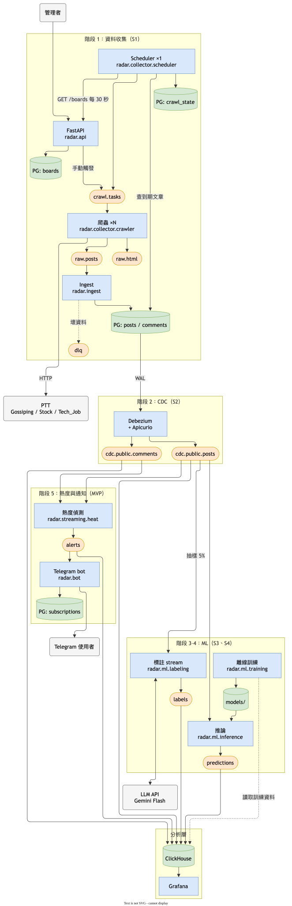

# 即時輿情雷達：開發流程規格

> 狀態：v0.3，對應設計文件 [realtime-sentiment-radar-design.md](realtime-sentiment-radar-design.md)
> 最後更新：2026-10-07

設計文件回答「要做什麼、為什麼」；本文件回答「怎麼做、做到什麼程度算完成」。兩者衝突時，先修設計文件再改本文件。**文件必須與程式同步**：行為、格式、相依套件有變動時，同一個 PR 內一併更新。

## 架構圖



- 框線分組對應第 6 章的階段；節點內第二行是 `src/radar/` 下的模組
- 顏色：藍＝自寫服務、橘＝Kafka topic、綠＝儲存（PG、ClickHouse、模型檔）、灰＝外部
- 編輯：用 draw.io 直接開啟 `architecture.drawio.svg`（圖檔內嵌原始圖），存檔後即更新

## 目錄

1. [開發環境與慣例](#1-開發環境與慣例)
2. [共用約定](#2-共用約定)
3. [訊息格式](#3-訊息格式)
4. [開發流程](#4-開發流程)
5. [測試策略](#5-測試策略)
6. [階段規格](#6-階段規格)
7. [設計補充（需回寫設計文件）](#7-設計補充需回寫設計文件)
8. [風險清單](#8-風險清單)

---

## 1. 開發環境與慣例

### 1.1 工具

| 項目 | 選擇 | 備註 |
|---|---|---|
| Python | 3.12 | 所有自寫服務共用 |
| 套件管理 | uv | `pyproject.toml` + `uv.lock` |
| Lint / format | ruff | 已在 pre-commit |
| 安全掃描 | bandit | 已在 pre-commit |
| 測試 | pytest、pytest-asyncio、testcontainers | |
| 設定 | pydantic-settings | 全部從環境變數讀，提供 `.env.example` |
| Kafka client | confluent-kafka | |
| Web API | FastAPI + uvicorn | 依賴以 `Annotated` 注入，測試以 `dependency_overrides` 換成 fake |
| HTTP client | httpx2 | 爬蟲對 PTT 發請求；測試用 `MockTransport`，Starlette 的 TestClient 也使用它 |
| HTML 解析 | selectolax（lexbor 後端） | 1.0 已移除舊的 `selectolax.parser` |
| PG 存取 | SQLAlchemy 2.0（driver 用 psycopg 3） | 用法分工見 2.4 |
| DB migration | Alembic | 由 ORM model 自動產生，再人工檢查 |
| ML | scikit-learn（含 joblib） | 階段 3 baseline；階段 4 推論也在同一個 image 內使用 |
| LLM 標註 | Groq、OpenRouter（OpenAI 相容 API）、Gemini REST，皆以 httpx2 直接呼叫 | 不用官方 SDK；包在 `Labeler` 介面後，換服務商只換實作；Claude 以 skill 手動標註（7.11） |
| CDC Avro 解碼 | `confluent-kafka[avro]` | Python 端讀 `cdc.public.*`（S3-08、階段 4） |
| Log | loggerhelper 2.0.0（`lib/` 內的 wheel） | `LOG_NAME` 設成服務名稱；訊息中帶 `post_id`（如有）；錯誤可選擇送 Slack |

### 1.2 Repo 結構

採用 src layout：所有 Python 程式碼放在 `src/radar/`，以套件 `radar` 安裝（`uv sync` 會以 editable 模式安裝），import 一律寫 `from radar.xxx import ...`，執行用 `python -m radar.collector.scheduler`。

本文件提到的程式碼路徑（如 `common/schemas.py`、`ml/labeling/backfill.py`）都相對於 `src/radar/`。設計文件 10.1 的結構之外，另外加上：

```
├── src/radar/               # Python 程式碼（見設計文件 10.1）
├── pyproject.toml
├── alembic.ini
├── Makefile                 # 常用指令入口
├── .env.example
├── infra/
│   ├── postgres/migrations/ # Alembic（alembic.ini 放在根目錄）
│   ├── kafka/topics.yaml    # topic 定義，由 scripts/create_topics.py 套用
│   ├── debezium/            # Connect image（含 Apicurio converter）、connector 設定
│   └── clickhouse/          # config.d、users.d、migrations/（編號 SQL）
├── docs/labeling-guideline.md  # 情緒標註準則（LLM、Claude、人工共用）
├── docs/reports/            # 實驗與模型評估報告（model-evaluation.md 由人撰寫；s3-05-push-ratio.md），進 repo
├── .claude/skills/label-posts/ # Claude 手動標註的 skill
├── scripts/
├── tests/
│   ├── unit/
│   ├── integration/
│   ├── e2e/                 # 假 PTT 伺服器與端到端測試
│   └── fixtures/ptt/        # 存下來的 PTT HTML
├── data/                    # 不進 repo：testset/、manual/、datasets/、prompt-tuning/
└── models/                  # 不進 repo：<model_version>/model.joblib、model_card.json
```

### 1.3 Makefile 指令

| 指令 | 動作 |
|---|---|
| `make up` / `make down` | 啟動 / 關閉基礎設施：Kafka ×3、PG、Apicurio、Kafka Connect、ClickHouse、Kafka UI |
| `make migrate` | `alembic upgrade head` |
| `make topics` | 依 `topics.yaml` 建立或更新 topic（冪等） |
| `make connector` | 註冊或更新 Debezium connector（冪等） |
| `make up-labeling` | 啟動串流抽樣標註（S3-08，會持續呼叫 LLM API） |
| `make testset` | 依看板配額抽出 300 篇人工測試集（Gossiping 180、Stock 90、Tech_Job 30；只能抽一次） |
| `make human-label` | 本機人工標註頁（http://127.0.0.1:8090） |
| `make ch-migrate` | 套用 ClickHouse 尚未執行的 migration |
| `make api` | 本機啟動管理 API（http://localhost:8000/docs） |
| `make seed` | 透過 API 建立初始看板（冪等，需先 `make api`） |
| `make up-app` | 基礎設施加上 api、scheduler、crawler ×3、ingest；`init` 自動建表、建 topic、ClickHouse migration、註冊 connector |
| `make e2e-up` / `make e2e` | 啟動端到端環境（假 PTT、e2e 專用 volume）/ 執行端到端測試 |
| `make e2e-down` | 停止端到端環境並刪除其資料 volume |
| `make lint` | ruff + bandit |
| `make test` | 單元測試 |
| `make test-int` | 整合測試（需要 Docker） |

### 1.4 分支與提交

- `main`：可部署版本；`develop`：開發整合
- 功能分支：`feat/s<階段>-<簡述>`，例如 `feat/s1-ptt-parser`，PR 合進 `develop`
- 每個階段驗收通過後，`develop` 合進 `main` 並打 tag `stage-<n>`
- 緊急修正從 `main` 開 `fix/*`，合回 `main` 後由 workflow 同步到 `develop`
- Commit 使用 Conventional Commits：`feat(crawler): ...`、`fix(ingest): ...`

---

## 2. 共用約定

### 2.1 識別碼與時間

- `post_id` = `<board>.<PTT 文章檔名>`，例如 `Stock.M.1759730000.A.1B2`
- 所有時間以 UTC 存放與傳遞（ISO 8601）；PTT 頁面時間是 `Asia/Taipei`，在 parser 轉換
- 推文時間沒有年份：取文章年份，推文月份小於文章月份時年份 +1

### 2.2 Kafka

| 項目 | 規則 |
|---|---|
| 序列化 | 自寫 topic 用 JSON（pydantic model 定義在 `common/schemas.py`）；CDC topic 用 Avro + Apicurio |
| 版本 | 每則 JSON 訊息帶 `schema_version`，只做向後相容的變更（加欄位） |
| Key | 依設計文件：`post_id`；`crawl.tasks` 的列表任務例外，用 `board`（見 7.1），且 partition 由送出端明確指定（見 7.10） |
| Producer | `acks=all`、`enable.idempotence=true`、`compression.type=zstd`、`message.max.bytes=5MB`（`raw.html` 爆文可能超過預設 1MB） |
| Consumer | 關閉 auto commit，處理完（含寫入下游）才 commit，at-least-once |
| 錯誤處理 | 暫時性錯誤（網路、DB 斷線）：指數退避重試，不 commit；資料錯誤（解析、驗證失敗，或 handler 回報寫不進下游的訊息）：寫入 `dlq` 後 commit（7.13） |
| 重試期間 | `pause()` 已分配的 partition 並持續 `poll()`，維持 group 成員資格；重試不限時間，成功後 `resume()`（#11：只 sleep 不 poll 會超過 `max.poll.interval.ms` 被踢出 group） |
| 重試上限 | 由各服務的 handler 決定，`BatchConsumer` 不設上限：爬蟲同一網址 5 次後略過；ingest 不設上限（PG 停機就等）；串流標註依服務商冷卻時間等待（`TransientError.retry_after_s`） |
| commit 失敗 | 失去 assignment（`_ASSIGNMENT_LOST`、`UNKNOWN_MEMBER_ID`、`ILLEGAL_GENERATION`、`REBALANCE_IN_PROGRESS`）記 warning 後繼續，該批由下一個取得 partition 的成員重做（冪等）；其他錯誤照舊中止 |
| 優雅關閉 | 收到 SIGTERM 先處理完當前批次、commit、再關閉；爬蟲一個列表任務可能需要 1 分鐘以上，compose 給 `stop_grace_period: 90s`，逾時被強制結束也只是該批重做 |

### 2.3 DLQ 訊息

```json
{
  "source_topic": "raw.posts", "partition": 1, "offset": 12345,
  "consumer": "ingest", "error": "ValidationError: ...",
  "payload_b64": "...", "failed_at": "2026-10-06T08:00:00Z"
}
```

### 2.4 PostgreSQL

- Schema 只透過 migration 變更，不手動改
- 表定義集中在 `common/db/models.py`（SQLAlchemy ORM model），是 schema 的唯一來源；Alembic 從這裡 autogenerate
- ORM model 只描述 PG 表；Kafka 訊息用 `common/schemas.py` 的 pydantic model，兩者不混用

| 場景 | 寫法 | 理由 |
|---|---|---|
| FastAPI 的 `boards` CRUD、bot 的 `subscriptions` | ORM（`Session`） | 單筆讀寫，ORM 最省事 |
| Ingest 批次 upsert | Core：`postgresql.insert().on_conflict_do_update(where=...)` | 一次寫 500 筆，ORM 逐筆 flush 太慢；帶條件 upsert 需要 Core 才寫得出來 |
| Scheduler 查詢到期文章 | Core `select()` | 只讀，回傳 tuple 即可 |
| Advisory lock、publication、`REPLICA IDENTITY` | `text()` 原生 SQL | 屬於 PG 專屬功能，ORM 不支援 |

- Alembic autogenerate 偵測不到 publication、`REPLICA IDENTITY` 等 PG 專屬設定，這類變更在 migration 中用 `op.execute()` 手寫
- 全部使用同步 API；FastAPI 的同步 endpoint 會在 threadpool 執行，目前流量不需要 async
- 每張表只有一個寫入者（設計文件 5.4）；新增表時必須在 migration 註解寫明寫入者、是否被 Debezium 監聽

---

## 3. 訊息格式

以下是 JSON 範例，正式定義以 `common/schemas.py` 的 pydantic model 為準。

### 3.1 `crawl.tasks`

```json
{
  "schema_version": 1, "task_id": "uuid",
  "type": "list",                 // list | post
  "board": "Stock",
  "url": "https://www.ptt.cc/bbs/Stock/index.html",
  "post_id": null,                // type=post 時必填
  "reason": "schedule",           // schedule | manual | recrawl
  "created_at": "..."
}
```

- `type=post` 必須帶屬於 `board` 的 `post_id`；`type=list` 不可帶
- Kafka key：list 任務用 `board`、post 任務用 `post_id`（`CrawlTask.kafka_key()`，見 7.1）
- list 任務的 partition 依啟用中看板的名稱排序輪流指定，不靠 key hash（`resolve_list_partition`，見 7.10）

### 3.2 `raw.posts`

```json
{
  "schema_version": 1, "task_id": "uuid",
  "post_id": "Stock.M.1759730000.A.1B2", "board": "Stock",
  "url": "...", "author": "...", "title": "...", "content": "...",
  "created_at": "...", "crawled_at": "...",
  "push_count": 12, "boo_count": 3, "is_deleted": false,
  "comments": [
    {"floor": 1, "type": "push", "user_id": "...", "content": "...", "commented_at": "..."}
  ]
}
```

- `push_count` / `boo_count` 由內頁推文計算，不用列表頁的數字（列表頁有「爆」「X1」等非數值）
- 驗證規則（不符合即 `ValidationError`，由 consumer 送 `dlq`）：
  - 所有時間必須帶時區，統一轉成 UTC
  - `post_id` 必須屬於 `board`；`floor` 從 1 開始且不重複
  - `push_count` / `boo_count` 必須等於推文中 push / boo 的數量，對不上代表 parser 有 bug
- **刪除快照**：文章頁 404 時送出 `is_deleted=true`、推噓數 0、沒有推文、`created_at` 由檔名 epoch 推算；Ingest 只據此標記刪除

### 3.3 `raw.html`

```json
{"schema_version": 1, "post_id": "...", "url": "...", "crawled_at": "...", "html": "..."}
```

### 3.4 `labels`

```json
{
  "schema_version": 1, "post_id": "...",
  "labeler": "groq:qwen/qwen3.8-27b", "version": "prompt-v5", "labeled_at": "...",
  "sentiments": [
    {"target": null, "polarity": "negative"},
    {"target": "台積電", "polarity": "positive"}
  ]
}
```

- `labeler`：實際標註的模型，OpenAI 相容服務商寫成 `<服務商>:<模型>`；Claude 手動標註為 `claude-sonnet-manual`
- `version`：prompt 版本（`PROMPT_VERSION`），與 `docs/labeling-guideline.md` 的版本一致
- 驗證規則：恰好一筆 `target = null`（整篇）；對象不可空白、不可重複；`polarity` 只能是 `positive`、`negative`、`neutral`
- 人工測試集的標註**不送這個 topic**，只存在本機 `data/testset/`，避免混進訓練資料

### 3.5 `predictions`

```json
{
  "schema_version": 1, "post_id": "...", "model_version": "tfidf-lr-20261020",
  "predicted_at": "...", "polarity": "negative",
  "scores": {"positive": 0.1, "negative": 0.7, "neutral": 0.2}
}
```

### 3.6 `alerts`

```json
{
  "schema_version": 1, "alert_id": "uuid",
  "unit_type": "post",            // post | board | entity | topic
  "unit_key": "Gossiping.M.1759730000.A.1B2",
  "board": "Gossiping",
  "window_start": "...", "window_end": "...",
  "value": 85, "baseline": 6.2, "zscore": 7.4,
  "sample_post_ids": ["..."], "created_at": "..."
}
```

---

## 4. 開發流程

### 4.1 每個任務的循環

1. **確認設計**：任務若改變資料流、表或 topic，先改設計文件
2. **介面先行**：先寫 pydantic model / ORM model + Alembic migration / topic 設定，並在 PR 中單獨可審
3. **實作 + 單元測試**
4. **整合測試**：在 compose 環境中跑通
5. **驗收**：對照第 6 章該階段的驗收標準
6. **更新文件**：README 中的啟動方式、本文件的任務勾選

### 4.2 完成定義（Definition of Done）

- [ ] `make lint`、`make test` 通過
- [ ] 新增的 consumer 有整合測試，至少涵蓋：正常處理、重複訊息（冪等）、壞訊息進 DLQ
- [ ] 新增的環境變數已加入 `.env.example`
- [ ] 新增服務已加入 docker-compose，且 `restart: unless-stopped`
- [ ] 不會對 PTT 發出真實請求的測試才能進 CI

---

## 5. 測試策略

| 層級 | 範圍 | 工具 | 執行時機 |
|---|---|---|---|
| 單元 | parser、upsert SQL 組裝、熱度計算、年齡分級 | pytest | 本地每次 commit；CI 於 PR 開到及合併到 `develop` / `main` 時 |
| 整合 | 單一服務 + 真實 Kafka / PG / ClickHouse（單節點即可） | testcontainers | CI 於 PR 開到及合併到 `develop` / `main` 時 |
| 端到端 | 整個 compose，用假 PTT 伺服器 | `make e2e-up && make e2e`（約 3～4 分鐘） | 每階段驗收 |
| 回放 | 把錄下來的 topic 資料重送，驗證熱度偵測 | 腳本 | 第 5 階段起 |

- **PTT fixture**：每種頁面至少存一份 HTML（一般文、刪除文、爆文、含 IP 的推文、跨年推文、被編輯過的文章），parser 測試只讀 fixture
- **假 PTT 伺服器**（`tests/e2e/fake_ptt.py`）：小型 FastAPI app，產生與 PTT 相同結構的頁面，並提供控制端點新增文章、推文、刪除文章；單元測試確認其頁面能被正式 parser 解析
- **端到端環境**：
  - 爬蟲以 `CRAWLER_PTT_BASE_URL` 改打假伺服器（只換主機，資料中的網址仍是 `www.ptt.cc`），任何請求都不會打到真的 PTT
  - Scheduler 以 `SCHEDULER_TIME_SCALE=0.05` 縮短重爬間隔
  - Postgres 與 Kafka 改掛 e2e 專用的 volume，不碰開發資料
  - 測試標記為 `e2e`，一般 `pytest` 與 CI 預設排除
- **端到端情境**：新看板被排程並寫入 PG、新推文在重爬後反映、刪除文被標記、停用看板後停止爬取、爬蟲停止期間的任務在重啟後接續處理；階段 2 起加上 CDC：新文章進 `posts_latest`、推文數變化進 `posts_history`、推文帶看板進 `comments`、內容沒變的重爬不產生 CDC 事件（`tests/e2e/test_cdc.py`）
- **LLM**：單元與整合測試一律用 `MockTransport` 或 fake，不呼叫真的 LLM API；prompt 調整才實際呼叫，結果存在 `data/prompt-tuning/`

---

## 6. 階段規格

規模估計：S = 1～3 天、M = 1 週、L = 2 週以上（以業餘時間計）。

### 進度

| 任務 | 狀態 | PR |
|---|---|---|
| 階段 0（S0-01～S0-06） | ✅ 完成 | #1 |
| S1-01 資料表與訊息格式 | ✅ 完成 | #2 |
| S1-02 PTT parser | ✅ 完成 | #4 |
| S1-03 看板管理 API、S1-08 初始看板 | ✅ 完成 | #5 |
| S1-04 爬蟲、S1-05 Ingest | ✅ 完成 | #6 |
| S1-06 Scheduler、S1-07 假 PTT 伺服器與端到端測試 | ✅ 完成 | #7 |
| 階段 1 驗收（24 小時實際運作） | ✅ 通過（2026-10-08），紀錄見階段 1「驗收紀錄」；驗收中修正 #15、#16 | — |
| 列表任務 partition 修正（7.10） | ✅ 完成；重跑「停掉爬蟲 10 分鐘」積壓 21 分鐘消化完（原 64 分鐘） | #9 |
| Consumer 重試期間維持成員資格（2.2） | ✅ 完成：pause/resume、commit 失去 assignment 不中止、爬蟲同一網址 5 次略過、串流標註依冷卻時間等待；整合測試重現並驗證（重試 10 秒 > `max.poll.interval.ms` 6 秒） | #11 |
| S2-01 Spike：ClickHouse 讀 Apicurio Avro | ✅ 完成（結論見設計文件 6.2；以 Debezium 3.7 / Apicurio 3.3 / ClickHouse 26.8 驗證） | #8 |
| S2-02～S2-06 CDC 與 ClickHouse | ✅ 程式完成；端到端測試（`tests/e2e/test_cdc.py`）2026-10-08 通過（首次執行時發現 image 缺 `infra/` 檔案等 3 個問題，見 7.9） | #8、#15 |
| 爬蟲略過重複的重爬任務（7.12） | ✅ 完成；2026-10-09 實測 `crawl.tasks` 積壓 10 分鐘內 3,355 → 1,709（部署前持續增加），期間略過約 1,500 個重複任務 | #21 |
| Ingest 逐筆隔離毒訊息（7.13） | ✅ 完成；整合測試以含 `\x00` 的文章重現（原本整批失敗、服務中止），修正後只有該筆進 DLQ | #12 |
| 階段 2 驗收（24 小時運作、WAL 延遲） | ⬜ 待執行 | — |
| S3-01 標註準則與 prompt | ✅ 完成（prompt-v4，`docs/labeling-guideline.md`；15 篇實測選定標註者）；2026-10-08 依交叉比對升 prompt-v5（規則 11～13） | #10 |
| S3-02～S3-08 標註、測試集、實驗、訓練、串流標註 | ✅ 程式完成；人工標註頁已在瀏覽器實測。實際標註、人工測試集、訓練待階段 2 累積資料後執行 | #10 |
| 階段 3 驗收（≥ 3,000 篇且各看板達標、評估報告含各看板 F1、推噓比結論） | ⬜ 待執行 | — |

階段 1 拆成 5 個 PR；全部完成後依下方「驗收」逐項驗證，通過才把 `develop` 合進 `main` 並打 `stage-1` tag。之後各階段相同：驗收通過才打 `stage-<n>` tag。

### 階段 0：專案骨架（S）

**目標**：任何人 clone 下來 `make up` 就能起來空的基礎設施。

| ID | 任務 |
|---|---|
| S0-01 | `pyproject.toml`、uv、ruff 設定；修正 pre-commit（見 8.2） |
| S0-02 | docker-compose：Kafka（KRaft 3 節點，副本數 3、`min.insync.replicas=2`）、PostgreSQL、Kafka UI（profile `debug`；階段 2 起改為預設啟動，部署前移除，見 S8-06） |
| S0-03 | `common/`：settings、logging、Kafka producer/consumer 包裝（含 DLQ、優雅關閉）、PG 連線池 |
| S0-04 | `infra/kafka/topics.yaml` + `scripts/create_topics.py`（冪等） |
| S0-05 | 共用 Dockerfile（一個 image，靠 `command` 區分服務） |
| S0-06 | GitHub Actions：lint + 單元測試 + 整合測試 |

**驗收**
- `make up && make migrate && make topics` 在乾淨機器上成功
- CI 綠燈

### 階段 1：資料收集到 PG（L）

**目標**：透過 API 管理看板，三個看板的資料持續流入 PG。

| ID | 任務 | 依賴 |
|---|---|---|
| S1-01 | Migration：`posts`、`comments`、`boards`、`crawl_state`（設計文件 5.3，加上 7.2 的欄位） | S0 |
| S1-02 | PTT parser：列表頁、內頁、推文、刪除文；fixture 測試 | — |
| S1-03 | FastAPI：`/boards` CRUD、`POST /boards/{board}/crawl`、`GET /status` | S1-01 |
| S1-04 | 爬蟲：消費 `crawl.tasks`，處理 `list` / `post` 任務，寫 `raw.posts`、`raw.html`；速率限制；列表快取（7.1） | S1-02 |
| S1-05 | Ingest：批次 upsert、同批去重（7.3）、壞訊息進 DLQ | S1-01 |
| S1-06 | Scheduler：`sync_boards`、`board:<name>`、`dispatch_due_posts`；PG advisory lock 保證單一 instance | S1-03 |
| S1-07 | 假 PTT 伺服器 + 端到端測試 | S1-04～06 |
| S1-08 | 種子資料：三個看板的初始設定 | S1-03 |

**初始看板設定**

| 看板 | `interval_sec` | `recrawl_min_push`（見 7.2） |
|---|---|---|
| Gossiping | 60 | 10 |
| Stock | 120 | 0 |
| Tech_Job | 600 | 0 |

**驗收**
- 用 API 新增、停用看板，Scheduler 在 30 秒內反映
- 連續運作 24 小時：三個看板都有新文章進 PG，熱門文章的 `push_count` 有隨時間更新
- 同一批 `raw.posts` 重送兩次，PG 的列內容不變（冪等）
- 停掉爬蟲 10 分鐘再啟動，任務接續處理，不需人工介入
- 對 PTT 的平均請求速率 ≤ 1 次/秒（由爬蟲 log 統計）
- `GET /status` 顯示各看板最後爬取時間與 DLQ 數量

**驗收紀錄**（2026-10-07 06:04:42Z～10-08 06:04:42Z，develop @ `1cdeb6a`；lag 每 10 分鐘記錄於 `log/acceptance/lag.log`；收尾的 e2e 與停爬蟲重跑在 develop @ `31910cf`）

| 項目 | 結果 |
|---|---|
| 看板同步 30 秒內反映 | ✅ 停用 3 秒、重新啟用 30 秒（以 Tech_Job 停用再啟用驗證；API 沒有 DELETE，新增測試看板會留下資料） |
| 停掉爬蟲 10 分鐘再啟動 | ✅ 重跑（含 #9）：10-08 07:28:59Z 停、07:39:28Z 啟動，積壓平均分散在三個 partition（重啟時 76 / 122 / 80），**1,284 秒（21 分鐘）**全部降到 ≤ 10，不需人工介入；首次執行時 partition 0 積壓 64 分鐘 → 7.10。紀錄：`log/acceptance/stop-test-20261008.log` |
| `GET /status` | ✅ 各看板 `last_changed_at`（見 7.7）與 DLQ 數量 |
| 熱門文章 `push_count` 隨時間更新 | ✅ 開跑後 30 分鐘內，39 篇中 18 篇有更新 |
| 24 小時三個看板都有新文章 | ✅ 期間發文 1,036 篇：Gossiping 941（17 篇已刪）、Stock 92、Tech_Job 3；列表任務完成 2,232 次（理論值 2,304，差額為停爬蟲測試與 crash 期間） |
| 請求速率 ≤ 1 次/秒 | ✅ 約 0.53 次/秒（翻頁最多時 0.58）。爬蟲不逐筆記錄請求，改以 log + Kafka 訊息數推算：列表頁 ≥ 2,232、內頁 200 共 42,858（`raw.html`）、404 共 19、52x 略過 41、逾時重試 283。52x：520 ×23、525 ×14、521 ×4（< 0.1%），**維持不重試**（見 8.1） |
| 同一批 `raw.posts` 重送兩次，PG 不變 | ✅ 50 篇已過重爬期的 Gossiping 文章（1,893 則推文）的最新快照各送兩次：`posts`、`comments` 的內容與 `xmin` 前後 md5 相同；ingest `received=101 posts_written=0 comments_inserted=0` |
| DLQ、解析失敗 | ✅ 24 小時內 DLQ 0 筆、parse 失敗 0 筆；`raw.posts` lag 最大 2 |
| 爬蟲穩定性 | ⚠️ 10-07 19:36～20:30Z 三個爬蟲共 crash 8 次（Docker 自動重啟，資料未遺失）：PTT 逾時無限重試超過 `max.poll.interval.ms`，失去 assignment → #11；期間 `crawl.tasks` lag 最高 492，21:00Z 前恢復 |
| 端到端測試（含 CDC） | ✅ 9/9（`test_pipeline` 5、`test_cdc` 4，首次執行 CDC）；途中修正 image 缺 `infra/` 檔案與 connector 剛建立時 404（#15）、Kafka 資料未寫進 volume（#16） |

驗收後待處理：#11（consumer 無限重試）、#12（毒訊息卡住 partition）、#13（刪除不可逆）、#14（推文樓層位移）；停爬蟲時 crawler-1 超過 10 秒被強制結束（exit 137），未 commit 的批次重啟後重做，不影響正確性。

### 階段 2：CDC 與 ClickHouse（M）

**目標**：ClickHouse 看得到推噓數變化歷程。

| ID | 任務 |
|---|---|
| S2-01 | **Spike**：驗證 ClickHouse `AvroConfluent` 能讀 Apicurio 序列化的訊息（見 8.1），結論寫回設計文件 |
| S2-02 | PG：`wal_level=logical`、只包含 `posts`、`comments` 的 publication |
| S2-03 | Kafka Connect + Debezium + Apicurio 加入 compose（參照 `kafka_tutorial/deployment` 的寫法）；connector 設定存在 `infra/debezium/`，用腳本註冊；**Apicurio 使用獨立的 database**，不可和 `radar` 共用，否則 Alembic autogenerate 會把 Apicurio 的表當成要刪除的表 |
| S2-04 | Debezium 設定：`table.include.list`、heartbeat、`ExtractNewRecordState`（附加 `__op`、`__source_ts_ms`、`__source_lsn`，刪除以 `delete.tombstone.handling.mode=rewrite` 改寫為 `__deleted`） |
| S2-05 | ClickHouse：Kafka engine 表 + materialized view → `posts_latest`、`posts_history`、`comments` |
| S2-06 | ClickHouse：`labels`、`predictions`、`alerts` 的 JSON topic 接入（`JSONEachRow`） |

**驗收**
- `posts_latest FINAL` 的筆數與 PG `posts` 一致（允許 1 分鐘延遲）
- 挑一篇熱門文章，`posts_history` 能畫出推文數隨時間的曲線
- 重爬但內容沒變的文章不產生 CDC 事件（比對 topic offset）
- 連續運作 24 小時，PG replication slot 的 WAL 延遲沒有持續增加

### 階段 3：LLM 標註與 baseline（L）

**目標**：第一版情緒模型與評估分數。

| ID | 任務 |
|---|---|
| S3-01 | 標註 prompt 與輸出 JSON schema（3.4 格式，含對象），10～20 篇手動調整到穩定 |
| S3-02 | `ml/labeling/backfill.py`：從 ClickHouse 依看板分層抽樣，主要標註者（`LABEL_PRIMARY`，目前 Groq qwen）標註，限速、可中斷續跑；`--testset` 只標人工測試集（見 7.11） |
| S3-03 | 第二個標註者（Claude，skill `/label-posts`）交叉標註；`cross_check` 輸出一致率、kappa 與不一致清單 CSV；`manual export --testset` 匯出人工測試集給 Claude 標 |
| S3-04 | 人工測試集：300 篇，依看板配額抽樣（`make testset`，見 7.11），以本機標註頁標註（`make human-label`），**不給任何模型訓練** |
| S3-05 | 推噓比弱標註實驗（設計文件 15.6），結論寫成短報告 |
| S3-06 | `ml/training/`：export → train → evaluate；TF-IDF（字元 n-gram，免斷詞）+ Logistic Regression；evaluate 依看板分開計算；依結果撰寫評估報告（見 7.11） |
| S3-07 | 模型產物：`models/<model_version>/`，含模型檔與 `model_card.json`（訓練資料版本、指標） |
| S3-08 | `ml/labeling/stream.py`：只處理 `op=c` 事件，用 `crc32(post_id) % 100 < 5` 抽樣（重跑結果一致；不用內建 `hash()`，它每個 process 結果不同）；`make up-labeling` 啟動 |

**驗收**
- 主要標註者的標註資料（不含測試集）合計 ≥ 3,000 篇，且各看板達到最低篇數：Gossiping ≥ 1,500、HatePolitics ≥ 600、Stock ≥ 400；Boy-Girl、Tech_Job 文章少（每天個位數），不設固定數字，截止時可用的文章全部標完
- 手寫的評估報告 `docs/reports/model-evaluation.md` 有這一版 baseline 的一節（內容要求見 7.11），涵蓋人工測試集上的：
  - baseline 的 macro-F1 與各類別 F1，整體與各看板（Gossiping、Stock、Tech_Job）分開列
  - LLM 標註者（主要標註者、Claude）與人工的一致率與 Cohen's kappa，整體與各看板分開列
  - 錯誤分析與結論
- 推噓比實驗報告 `docs/reports/s3-05-push-ratio.md` 有明確結論（採用 / 改當特徵 / 不採用）

### 階段 4：推論 consumer（S）

**目標**：新文章自動帶情緒分數。

| ID | 任務 |
|---|---|
| S4-01 | `ml/inference/main.py`：消費 `cdc.public.posts`，啟動時載入指定的 `model_version` |
| S4-02 | 觸發條件：`op=c` 一律推論；`op=u` 只在內文 hash 與本地快取不同時推論（大部分更新只是推噓數） |
| S4-03 | 寫入 `predictions` |

**驗收**
- 新文章從進 PG 到 ClickHouse 出現推論結果，p95 < 1 分鐘
- 推噓數更新不會觸發重複推論（比對 `predictions` 筆數與新文章數）

### 階段 5：熱度偵測與 Telegram bot（L，**MVP**）

**目標**：話題暴增時收到 Telegram 通知。

| ID | 任務 |
|---|---|
| S5-01 | `streaming/heat.py`（Quix Streams）：依 `post_id` 與 `board` 統計推文數，視窗 10 分鐘、每 1 分鐘滑動 |
| S5-02 | 時間基準用 `commented_at`（event time），寬限 5 分鐘；超過 1 小時的舊推文只更新基準、不觸發警示（避免 CDC 初始 snapshot 或首次爬到爆文時誤報） |
| S5-03 | 基準：每個 key 用 EWMA 維護平均與變異數，存在 Quix state |
| S5-04 | 觸發條件（可設定）：z-score ≥ 3 **且** 視窗內推文數 ≥ 30；同一 key 30 分鐘內不重複警示；新 key 需累積 1 小時才啟用 |
| S5-05 | 錄製與回放工具：把真實的 `cdc.public.comments` 存成檔案，可重送到測試 topic |
| S5-06 | Migration：`subscriptions(chat_id, unit_type, unit_key)`，寫入者 bot，不被 Debezium 監聽 |
| S5-07 | `bot/main.py`：long polling；消費 `alerts` 依訂閱推送；指令 `/start`、`/boards`、`/subscribe <board>`、`/unsubscribe`、`/hot` |
| S5-08 | （非 MVP 必要）每日 08:00 LLM 摘要 |

**驗收**
- 回放測試：注入一段人工製造的暴增，2 分鐘內收到 Telegram 通知
- 連續運作 3 天：每個看板每天警示數 ≤ 10，人工檢查「值得看」的比例 ≥ 70%
- 重啟 heat 服務後狀態可恢復，不會重新觸發已發過的警示

### 階段 6：Dashboard（S）

| ID | 任務 |
|---|---|
| S6-01 | Grafana + ClickHouse datasource，以 provisioning 檔版本控管 |
| S6-02 | 面板：各看板推文量曲線、情緒分布、近 24 小時警示列表、熱門文章排行 |

**驗收**：`make up` 後打開 Grafana 不需手動設定即可看到所有面板。

### 階段 7：BERT 與 shadow 比較（M）

| ID | 任務 |
|---|---|
| S7-01 | Colab / Kaggle fine-tune 中文 BERT，匯出 CPU 可用的模型（可考慮 ONNX） |
| S7-02 | 新 inference instance 用新 consumer group 與新 `model_version` 並行 |
| S7-03 | ClickHouse 查詢比較兩版：與人工測試集的 macro-F1、兩版不一致的文章、推論延遲 |

**驗收**：比較結果寫入手寫的評估報告 `docs/reports/model-evaluation.md`（與階段 3 的 baseline 同一份），決定是否切換預設模型。

### 階段 8：上雲（M）

| ID | 任務 |
|---|---|
| S8-01 | 確認所有 image 有 arm64 版本（Oracle 免費 ARM） |
| S8-02 | Terraform：VM、網路、磁碟；VM 上跑 docker-compose |
| S8-03 | Secrets 不進 repo（`.env` 由部署流程注入） |
| S8-04 | PG 每日備份到另一個磁碟或物件儲存 |
| S8-05 | 磁碟使用量監控：Kafka log、PG WAL、ClickHouse |
| S8-06 | 移除 Kafka UI（開發期間預設啟動，沒有身分驗證） |

**驗收**：連續運作 7 天不需人工介入，磁碟使用量穩定。

### 後續階段

| 階段 | 內容 | 前置 |
|---|---|---|
| 9 | 實體熱度：CKIP NER + 自訂詞典，`unit_type=entity` | 階段 5 |
| 10 | 主題熱度：離線 BERTopic + 線上指派，`unit_type=topic` | 階段 9、累積 1 個月以上資料 |
| 11 | aspect-based 模型（利用階段 3 已標註的對象） | 階段 7 |

---

## 7. 設計補充

寫規格與實作時發現設計文件沒說清楚的地方，以下是決定。**7.1～7.8 皆已回寫設計文件（2026-10-07）；7.9 部分已寫入設計文件 6.1～6.3，其餘待階段 2 驗收後回寫；7.10 已回寫設計文件 3.1；7.11 部分已寫入設計文件 7.4，其餘待階段 3 驗收後回寫；7.12 已回寫設計文件 4.5、4.6；7.13 已回寫設計文件 5.1**，本章保留決策理由。

### 7.1 爬蟲如何判斷「推文數沒變就不抓內頁」

設計要求爬蟲不碰 PG，但又要知道列表頁上的推文數有沒有變。

- 列表任務的 Kafka key 用 `board`，同一個看板固定由同一個爬蟲處理
- 爬蟲在記憶體保留 `post_id → 列表推文數` 的 LRU 快取
- 列表上的文章不在快取中或推文數改變 → 抓內頁
- 顯示「爆」的文章視為沒變，交給 `dispatch_due_posts` 定期重爬
- Rebalance 或重啟後快取清空，只會多抓幾次內頁，upsert 會擋掉沒變化的寫入，結果仍正確
- 列表任務的 partition 由送出端明確指定，見 7.10

### 7.2 重爬請求量超出預算

依設計文件 4.2 的年齡分級，每篇文章 24 小時內會被重爬約 78 次。Gossiping 一天若有 3,000 篇，光重爬就約 2.7 次/秒，容易被封鎖。

- `boards` 加欄位 `recrawl_min_push INT NOT NULL DEFAULT 0`
- 文章滿 1 小時後，推文數低於門檻就停止重爬
- Gossiping 先設 10，依實際請求量調整

### 7.3 Ingest 同一批次內有重複的 `post_id`

PostgreSQL 的 `INSERT ... ON CONFLICT DO UPDATE` 不能在同一個語句裡更新同一列兩次，會直接報錯。批次寫入前先在記憶體依 `post_id` 去重，保留 `crawled_at` 最新的一筆；推文依 `(post_id, floor)` 去重。

### 7.4 推文樓層的穩定性

`floor` 是推文在頁面中的順序。作者編輯文章時可能刪改推文，導致樓層位移、新舊推文對不上。MVP 接受此誤差；若實測影響明顯，再改用 `(user_id, commented_at, content)` 的 hash 當推文識別。

### 7.5 刪除文的處理（S1-04、S1-05）

文章頁 404 時，爬蟲送出刪除快照；若 Ingest 直接 upsert，推噓數會被清成 0、內文會被清空。因此 Ingest 只把既有文章的 `is_deleted` 設為 true，保留刪除前的內容；從未見過的文章略過。

### 7.6 標題列入變化判斷（S1-05）

設計原本只比對推噓數與內文。作者有時會改標題，不比對的話 `posts.title` 永遠停在第一次爬到的版本，所以 upsert 也比對並更新標題。

### 7.7 `/status` 顯示最後變化時間（S1-03）

設計原本寫「各看板最後爬取時間」，但 Ingest 只在內容有變化時寫入 `posts`，從 PG 拿不到真正的爬取時間。先回傳 `last_changed_at`（最後一次有變化），足以判斷資料是否持續流入；真正的爬取時間待爬蟲有記錄後再補。

### 7.8 Scheduler 的實作選擇（S1-06）

- 用 `BlockingScheduler` 而非設計範例的 `AsyncIOScheduler`：專案程式皆為同步，async 版本只會多一層事件迴圈
- 新看板的計時器立刻執行一次，否則 `interval_sec` 較長的看板（例如 Tech_Job 600 秒）要等很久才第一次爬
- 每輪最多派發 500 篇重爬，高峰期分散到後面幾輪，避免爬蟲任務大量積壓
- 已刪除的文章與停用看板的文章不再重爬

### 7.9 CDC 與 ClickHouse 的部署方式（S2-02～S2-06）

- **Apicurio 的 database**：PG 的 init script 只在空 volume 時執行，既有環境不會跑；改由一次性服務 `apicurio-db-init` 以 `CREATE DATABASE ... WHERE NOT EXISTS` 建立（冪等），Apicurio 等它完成才啟動
- **Publication**：Alembic migration 建立 `radar_cdc`（只含 `posts`、`comments`），schema 變更都走 migration；Debezium 設 `publication.autocreate.mode=disabled`
- **Connector 註冊**：`infra/debezium/radar-cdc.json` 以 `${VAR}` 引用環境變數，`scripts/register_connector.py` 替換後 `PUT /connectors/<name>/config`（冪等，設定有變就更新）
- **ClickHouse schema**：`infra/clickhouse/migrations/NNNN_<name>.sql`，`scripts/migrate_clickhouse.py` 透過 HTTP 介面依序執行，已執行的版本記在 ClickHouse 的 `schema_migrations` 表
- **Image 內容**：`init` 在 container 內執行上述腳本，`Dockerfile` 必須 COPY `infra/clickhouse/migrations/` 與 `infra/debezium/radar-cdc.json`；migration 資料夾不存在或沒有檔案時直接報錯，不可當成「沒有待執行的 migration」默默略過
- **等待 connector 啟動**：PUT 建立後狀態是非同步產生的，剛建立時查 `/status` 會先回 404，視為尚未就緒繼續輪詢，逾時才報錯
- **執行順序**（`init` 服務）：Alembic → topic → ClickHouse migration → 註冊 connector。ClickHouse 先建好才開始產生 CDC 事件；Kafka engine 表從最早的 offset 讀，順序顛倒也不會掉資料
- Apicurio、Kafka Connect、ClickHouse 放在預設 profile（`make up` 就啟動），階段 2 起它們是資料流的一部分

### 7.10 列表任務的 partition 分配（fix，2026-10-07）

階段 1 驗收時發現：`Gossiping`、`Stock`、`Tech_Job` 的 key hash 後都落在 `crawl.tasks` 的 partition 0，全部列表任務由同一個爬蟲處理；停機 10 分鐘後，該 partition 每分鐘消化約 12 個、流入約 11 個，積壓幾乎消不掉，另外兩個爬蟲只處理重爬。

- 送出列表任務時明確指定 partition：啟用中的看板依名稱排序，第 i 個看板 → `i % partition 數`；key 仍為 `board`
- Scheduler 用最近一次同步到的看板清單，API（手動觸發）查 PG；兩邊的看板清單一致，算出的 partition 就一致
- 看板不在清單中（例如剛新增、Scheduler 還沒同步，或手動觸發停用中的看板）→ 不指定，退回 key hash
- 新增或停用看板會讓部分看板換 partition，只造成一次列表快取失效（7.1），結果仍正確
- partition 數向 broker 查詢，不寫死；查詢失敗同樣退回 key hash，不讓任務停送（`resolve_list_partition`）

### 7.11 LLM 標註與 baseline 的實作選擇（S3-01～S3-08）

- **呼叫方式**：httpx2 直接呼叫，不用官方 SDK；Gemini 以 `responseSchema`、OpenAI 相容 API 以 `response_format: json_schema` 要求固定 JSON；`Labeler` 介面隔離實作
- **標註者來源**（皆實作 `Labeler`，產出相同的 `Label`，以 `labeler` 欄位區分）：
  - Gemini REST（`GeminiLabeler`）
  - OpenAI 相容 API（`OpenAICompatibleLabeler`）：Groq、OpenRouter 共用一個實作，只換 base URL、key、模型
  - Claude（手動）：`export` 匯出一批文章 → 在 Claude Code 執行 skill `/label-posts` 標註 → `import` 驗證後送 Kafka；`labeler` 記為 `claude-sonnet-manual`。使用訂閱額度、由人觸發；需要全自動時改走 Anthropic API
- **主要標註者**：固定一個模型跑完整個 backfill，不混用（系統性偏差不會因資料量變多而抵銷，反而被學得更確定）。由同一批 15 篇比較後選定 `groq: qwen/qwen3.8-27b`（見下方「模型實測」）
- **第二標註者**：Claude Sonnet（手動 skill），與主要標註者不同家族，錯誤較不相關，交叉比對才有意義；量約 1,000～1,500 篇；只標主要標註者已標過的文章，兩邊才有重疊可比
- **額度以「專案 × 模型」計算**（Gemini 429 的 quotaId 為 `...PerProjectPerModel`）：同一專案輪流使用不同模型屬正常使用，多開專案或帳號湊同一模型的額度則可能違反條款
- **限速**：免費額度以每分鐘、每日請求數計，各服務商的 `*_MIN_INTERVAL_S` 控制間隔；3,000 篇可能要分數天跑，backfill 必須可中斷續跑
- **寫入**：標註結果送 Kafka `labels`（3.4），經 S2-06 進 ClickHouse；**不寫 PG**
- **續跑**：抽樣時排除 ClickHouse `labels` 已有相同 `labeler` + `version` 的文章
- **抽樣**：`posts_latest FINAL`，排除刪除文與空內文，依看板分層，以 `cityHash64(post_id, seed)` 排序取前 N 篇（同一個 seed 重跑結果一致）
- **送給模型的文字**：標題 + 內文，內文超過 `LABEL_MAX_CHARS`（預設 2,000 字）截斷，控制 token
- **人工測試集**：先抽 300 篇，`post_id` 清單存 `data/testset/post_ids.txt`，人工標註存 `data/testset/human_labels.jsonl`（`data/` 不進 repo）；訓練匯出一律排除這些文章
  - 依看板指定配額（`--counts Gossiping=180 Stock=90 Tech_Job=30`），不平均分配：Tech_Job 每天約 3 篇，抽太多就沒有文章可訓練；Stock 每天約 90 篇，留給訓練的會持續增加
  - 任一看板可用文章不足配額時直接報錯，不默默少抽
  - 只從階段 1 的三個看板抽；階段 3 新增的看板不在測試集內，沒有各自的 F1
  - 主要標註者與 Claude **也要標測試集**（`backfill --testset`、`manual export --testset`），才算得出「LLM vs 人工」一致率；這些標註照樣送 `labels`，但 export 一律排除測試集，不會進訓練資料。一般抽樣（backfill、manual export）仍排除測試集，避免佔用額度
- **階段 3 新增看板**（透過 API，不改程式）：`HatePolitics`（`interval_sec` 120、`recrawl_min_push` 10）、`Boy-Girl`（男女版，300、0），增加輿情話題的多樣性；只進 LLM 標註與訓練資料
- **人工標註頁**：`python -m radar.ml.labeling.human_app`，只綁 `127.0.0.1`，一篇一頁、鍵盤選情緒，可補對象
- **訓練資料**：每篇取主要標註者的整篇情緒（`target IS NULL`）；兩個標註者整篇情緒不一致的文章不進訓練集，改列入 S3-03 的人工檢查 CSV
- **評估報告**：`docs/reports/model-evaluation.md`（進 repo）**由人撰寫**，不由程式產生；所有模型版本的分數與分析集中在這一份，之後的模型（階段 7）也寫在這裡。**報告寫完，模型的評估才算完成**
  - 數字來源：`evaluate` 輸出的 `models/<model_version>/evaluation.md`（不進 repo），含整體與各看板（Gossiping、Stock、Tech_Job）的 macro-F1、各類別 F1、整體混淆矩陣，以及 LLM 標註者 vs 人工（整體與各看板）的一致率與 kappa
  - 每個模型版本一節，至少寫：訓練資料（篇數、各類別數、標註者與 prompt 版本）、上述分數、錯誤分析（看幾篇判錯的文章，歸納原因）、結論與下一步
  - Tech_Job 只有 30 篇，F1 誤差大，只供參考
- **模型產物**：`models/<model_version>/model.joblib` 與 `model_card.json`（`models/` 不進 repo）；`model_version` = `tfidf-lr-<UTC 日期時間>`
- **S3-08 串流標註**用 `confluent-kafka[avro]` 解 Apicurio 序列化的 Avro（schema registry client 打 Apicurio 的 ccompat API）；階段 4 推論沿用同一套
- **服務商輪替**：`FallbackLabeler` 依序嘗試多個 `Labeler`，遇到每日額度用完換下一個；只用在串流標註（S3-08）。backfill 固定主要標註者，額度用完就停、隔天續跑
- **標註準則**（prompt-v5，全文與修訂紀錄見 `docs/labeling-guideline.md`）：
  - 提問文分真心發問（整篇 neutral、被評價的對象照列）與反問酸人（依規則 5 判斷語氣）；未指名的對象不列；只有表情符號或一兩個字 → neutral（v5）
  - 升版時已標的 v4 資料保留、不自動重標，各查詢以 `version` 區分；Groq v4 的 240 篇是否重標另行決定
  - 標題為 `[新聞]` 的文章只看作者的「心得/評論」段落；沒有或空白 → 整篇 neutral
  - 心得用了帶評價的字眼（例如「慘敗」「被打爆」「笑死」）即視為表態，整篇與該對象都依字眼的語氣判斷；只是中性摘要 → neutral。v2、v3 曾規定「整篇 neutral、對象另判」，三個模型都無法遵守，v4 改成人與模型都能一致遵守的版本
  - 轉貼他人貼文時，被轉貼者的立場不是作者的立場；只被提及、被詢問的對象不列
  - LLM、Claude skill、人工測試集使用同一份準則；`RULES` 與文件逐字一致由單元測試檢查
- **人工標註頁的輔助**：心得段落加底色並可跳轉、引用他人的行變灰（對應準則規則 7、9）；新增對象的情緒預設與整篇相同，避免沒改下拉選單而默默存成中立（瀏覽器實測發現）
- **調 prompt 的資料**（S3-01）：10～20 篇直接從 PG 取，不必等 ClickHouse
- **限速器**：`RateLimiter` 從 `collector/` 搬到 `common/rate_limit.py`，爬蟲與標註共用
- **模型實測**（2026-10-07，prompt 調整用的 15 篇）：主要標註者 `groq: qwen/qwen3.8-27b`；`gemini-3.1-flash-lite` 當串流備援；`gemini-3.5-flash` 免費 20 次/天、`gemini-3.1-pro` 免費額度為 0、`gemma-4` 在 Gemini 回 500、OpenRouter 免費模型全部被限速
- **錯誤分類**：每分鐘限速、5xx、連線錯誤可重試；每日額度用完停止（backfill）或換下一個（串流）；輸出格式不符重送一次（qwen 偶爾漏掉整篇那一筆）；API key、模型名稱錯誤直接中止，不逐篇略過
- **串流標註**：`FallbackLabeler` 依 `LABEL_PRIMARY`、`LABEL_FALLBACKS` 順序嘗試，額度用完的冷卻 1 小時；全部用完時拋出帶 `retry_after_s`（最早結束冷卻的時間）的錯誤，consumer 暫停到那時再試，不每 30 秒空轉；`Label.labeler` 記錄實際使用的模型。Schema registry 連不上時服務停止、由 docker 重啟，不送 DLQ（否則暫時故障會讓所有訊息進 DLQ）

### 7.12 爬蟲略過重複的重爬任務（fix，2026-10-09，#21）

2026-10-08 新增 HatePolitics、Boy-Girl 後，`crawl.tasks` 每分鐘流入約 43 個任務，超過 3 個爬蟲的消化量。Scheduler 派發時就推進 `next_crawl_at`，任務在佇列裡等超過重爬間隔，同一篇會再派一次（一輪曾派 78 個），積壓越多重複越多。

- **不在 Scheduler 端判斷**：Ingest 只在內容有變化時寫 `posts`（7.7），推文數沒變的重爬不會更新 `crawled_at`，Scheduler 分不出「還在佇列」與「抓過但沒變」
- 爬蟲以 LRU（`RecentFetches`）記住 `post_id → 最後一次收到內頁回應的時間`（含 404、解析失敗；連線錯誤不算）；文章任務的 `created_at` 早於這個時間就略過，不發請求
- 文章任務以 `post_id` 為 key，同一篇固定落在同一個 partition；列表任務順帶抓的內頁也記錄，同一個爬蟲收到的重爬可一併略過
- 判斷用 Scheduler 的時鐘（`created_at`）比爬蟲的時鐘（抓取時間），兩者在同一台主機，誤差可忽略；誤差只會讓少數任務多抓或少抓一次
- 重啟或 rebalance 後清空，只會多抓幾次，結果仍正確
- 去重後若消化量仍不足，先透過 API 調整看板的 `interval_sec`、`recrawl_min_push`；不放寬限速，也暫不加 Scheduler 端背壓

### 7.13 Ingest 逐筆隔離毒訊息（fix，2026-10-09，#12）

能通過 `RawPost` 驗證、寫入 PG 時卻觸發 DB 錯誤的訊息，原本會讓 ingest 停止；Docker 重啟後讀到同一批又失敗，無限 crash，整個 partition 卡住。

- **錯誤分類**：`IntegrityError`、`DataError` 視為該筆資料有問題（2026-10-09 實測文字含 `\x00` 時 psycopg 拋 `DataError`）；`OperationalError` 仍是暫時性錯誤；其他 DB 錯誤仍中止服務
- **逐筆模式**：整批寫入遇到資料錯誤 → rollback → 每筆在自己的 savepoint 寫入；失敗的回報給 consumer，其他照常 commit
- **介面**：`BatchConsumer` 的 handler 可回傳 `list[Rejection]`（`index` 對應傳入的第幾筆、`error`），consumer 依 index 找回原始 `Message` 送 `dlq` 後才 commit；回傳 `None` 等同全部成功，既有 handler 不必改
- 同批去重（7.3）後才逐筆寫入；被去重掉的重複訊息不送 DLQ

---

## 8. 風險清單

### 8.1 技術風險

| 風險 | 影響 | 對策 |
|---|---|---|
| ~~ClickHouse 讀不了 Apicurio 的 Avro 格式~~ | 階段 2 卡住 | **已排除（S2-01，2026-10-07）**：可直接讀，條件見設計文件 6.2 |
| Debezium / Apicurio 升級後行為改變 | CDC 或 ClickHouse 讀取中斷 | 版本固定在 `.env.example`；升級時重跑設計文件 6.2 的檢查（2.x → 3.x 時就發現設定名稱被移除且不報錯） |
| PTT 封鎖 IP | 資料中斷 | 請求速率預算（≤ 1 次/秒）、隨機間隔、7.2 的重爬門檻 |
| PTT 版面改版 | parser 失效 | `raw.html` 保留 3 天可重新解析；parser 失敗記 ERROR（可送 Slack），驗證失敗的訊息進 DLQ，`/status` 可看到 DLQ 數量 |
| PTT 恢復伺服器端的 over18 檢查 | 列表頁變成確認頁 | 2026-10 實測伺服器端已不檢查（只在瀏覽器以 JS 導向）；爬蟲仍帶 `over18=1` cookie，parser 遇到確認頁會拋 `ParseError` |
| LLM 免費額度不足或政策改變 | 標註進度變慢或成本上升 | 實測 `gemini-3.5-flash` 免費只有 20 次/天、`gemini-3.1-pro` 為 0；`Labeler` 介面可換服務商（Groq、OpenRouter、Gemini）或改付費 Batch API；backfill 可中斷續跑 |
| 單機記憶體不足（設計估 6～7GB） | 服務被 OOM kill | JVM heap 上限；階段 2 完成時實測記憶體 |
| PTT 回 HTTP 520（Cloudflare） | 該篇內頁本輪略過 | 24 小時驗收：520 ×23、525 ×14、521 ×4，佔請求 < 0.1%，之後的重爬會再抓到；**決定維持不重試**（重試會增加觸發 #11 的機會） |
| 開發機休眠 | 長時間驗收中斷、數據缺一段 | 驗收期間 `caffeinate -dims` 並接電源、不闔上螢幕（闔上仍會強制睡眠）；上雲後（階段 8）不再依賴開發機 |
| 標註的系統性偏差 | 模型學到錯誤標準，資料越多越確定 | 固定主要標註者、改 prompt 修偏差、兩個不同家族的標註者交叉比對、人工測試集裁決（7.11） |
| Python 端讀不了 CDC 的 Avro | S3-08 串流標註、階段 4 推論卡住 | 採用 `confluent-kafka[avro]`（fastavro + 官方 schema registry client，打 Apicurio 的 ccompat API）；已用 mock schema registry 與 S2-01 實測的欄位驗證解碼，待以實際 CDC 訊息確認 |

### 8.2 現有 repo 設定問題

| 檔案 | 問題 | 修正 |
|---|---|---|
| `.pre-commit-config.yml` | pre-commit 預設只讀 `.pre-commit-config.yaml`，目前檔名不會生效 | 改名為 `.yaml` |
| `.pre-commit-config.yml` | bandit 參數 `"lll"` 少了 `-`，會被當成檔案路徑 | 改為 `"-lll"` |
| `.github/workflows/sync_branch.yml` | `git checkout -B origin/develop` 會建立名為 `origin/develop` 的本地分支，之後 `git push origin develop` 找不到本地 `develop` | 改為 `git checkout -B develop origin/develop` |

以上已於 2026-10-06 第一次 commit 前修正。
